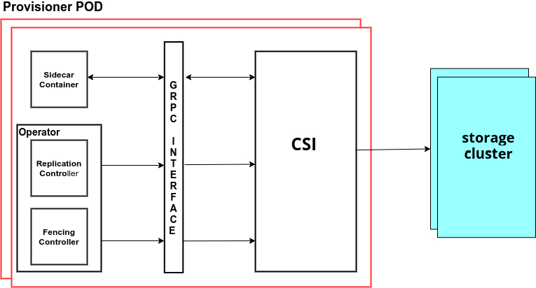

# spec

## Terminology

| Term     | Definition                                                                            |
| -------- | ------------------------------------------------------------------------------------- |
| VolumeID | The identifier of the volume generated by the plugin.                                 |
| CO       | Container Orchestration system that communicates with plugins using CSI service RPCs. |
| SP       | Storage Provider, the vendor of a CSI plugin implementation.                          |
| DR       | Disaster Recovery.                                                                    |
| RPC      | [Remote Procedure Call](https://en.wikipedia.org/wiki/Remote_procedure_call).         |

## Objective

Define a standard that will enable storage vendors (SP) to develop controllers/plugins for DR or to talk to the different CO systems.

### Goals in MVP

The new standard will

* Provide API at volume level granularity.
* Enable SP authors to write one replication compliant plugin that “just works” across all COs that implement RPC.
* Define API (RPCs) that enable:
  * Enable/Disable volume replication.
  * Promote/Demote volume.
  * Resync volume to solve the issue before using the volume.

### Non-Goals in MVP

* Replication at different granular levels
* Replication of volume snapshots.

## Solution Overview

This specification defines an interface along with the minimum operational and packaging recommendations for a storage provider (SP) to implement a Replication compatible plugin. The interface declares the RPCs that a plugin MUST expose.

## Architecture



## RPC Interface

* **Controller Service**: The Controller plugin MUST implement these sets of RPCs.

```protobuf
// Controller holds the RPC methods for replication and all the methods it
// exposes should be idempotent.
service Controller {
  // EnableVolumeReplication RPC call to enable the volume replication.
  rpc EnableVolumeReplication (EnableVolumeReplicationRequest)
  returns (EnableVolumeReplicationResponse) {}
  // DisableVolumeReplication RPC call to disable the volume replication.
  rpc DisableVolumeReplication (DisableVolumeReplicationRequest)
  returns (DisableVolumeReplicationResponse) {}
  // PromoteVolume RPC call to promote the volume.
  rpc PromoteVolume (PromoteVolumeRequest)
  returns (PromoteVolumeResponse) {}
  // DemoteVolume RPC call to demote the volume.
  rpc DemoteVolume (DemoteVolumeRequest)
  returns (DemoteVolumeResponse) {}
  // ResyncVolume RPC call to resync the volume.
  rpc ResyncVolume (ResyncVolumeRequest)
  returns (ResyncVolumeResponse) {}
}
```

### EnableVolumeReplication

```protobuf
// EnableVolumeReplicationRequest holds the required information to enable
// replication on a volume.
message EnableVolumeReplicationRequest {
  // The identifier for this volume, generated by the plugin during
  // CreateVolume CSI RPC call.
  // This field is REQUIRED.
  // This field MUST contain enough information to uniquely identify
  // this specific volume vs all other volumes supported by this plugin.
  // This field SHALL be used by the CO in subsequent calls to refer to
  // this volume.
  string volume_id = 1;
  // Plugin specific parameters passed in as opaque key-value pairs.
  map<string, string> parameters = 2;
  // Secrets required by the plugin to complete the request.
  map<string, string> secrets = 3 [(replication_secret) = true];
}

// EnableVolumeReplicationResponse holds the information to send when
// replication is successfully enabled on a volume.
message EnableVolumeReplicationResponse {
}
```

#### Error Scheme

| Condition                    | gRPC Code          | Description                                                                                                                                                                                                                                                                                                                                                                                                                                                                                                                               | Recovery Behavior                                                                                                                                                                                                                     |
| ---------------------------- | ------------------ | ----------------------------------------------------------------------------------------------------------------------------------------------------------------------------------------------------------------------------------------------------------------------------------------------------------------------------------------------------------------------------------------------------------------------------------------------------------------------------------------------------------------------------------------- | ------------------------------------------------------------------------------------------------------------------------------------------------------------------------------------------------------------------------------------- |
| Missing required field       | 3 INVALID_ARGUMENT | Indicates that a required field is missing from the request.                                                                                                                                                                                                                                                                                                                                                                                                                                                                              | Caller MUST fix the request by adding the missing required field before retrying.                                                                                                                                                     |
| Volume does not exist        | 5 NOT_FOUND        | Indicates that a volume corresponding to the specified `volume_id` does not exist.                                                                                                                                                                                                                                                                                                                                                                                                                                                        | Caller MUST verify that the `volume_id` is correct and that the volume is accessible and has not been deleted before retrying with exponential back off.                                                                              |
| Operation pending for volume | 10 ABORTED         | Indicates that there is already an operation pending for the specified `volume_id`. In general the Cluster Orchestrator (CO) is responsible for ensuring that there is no more than one call "in-flight" per `volume_id` at a given time. However, in some circumstances, the CO MAY lose state (for example when the CO crashes and restarts), and MAY issue multiple calls simultaneously for the same `volume_id`. The Plugin, SHOULD handle this as gracefully as possible, and MAY return this error code to reject secondary calls. | Caller SHOULD ensure that there are no other calls pending for the specified `volume_id`, and then retry with exponential back off.                                                                                                   |
| Not authenticated            | 16 UNAUTHENTICATED | The invoked RPC does not carry secrets that are valid for authentication.                                                                                                                                                                                                                                                                                                                                                                                                                                                                 | Caller SHALL either fix the secrets provided in the RPC, or otherwise regalvanize said secrets such that they will pass authentication by the Plugin for the attempted RPC, after which point the caller MAY retry the attempted RPC. |
| Error is Unknown             | 2 UNKNOWN          | Indicates that a unknown error is generated                                                                                                                                                                                                                                                                                                                                                                                                                                                                                               | Caller MUST study the logs before retrying                                                                                                                                                                                            |

### DisableVolumeReplication

```protobuf
// DisableVolumeReplicationRequest holds the required information to disable
// replication on a volume.
message DisableVolumeReplicationRequest {
  // The identifier for this volume, generated by the plugin during
  // CreateVolume CSI RPC call.
  // This field is REQUIRED.
  // This field MUST contain enough information to uniquely identify
  // this specific volume vs all other volumes supported by this plugin.
  // This field SHALL be used by the CO in subsequent calls to refer to
  // this volume.
  string volume_id = 1;
  // Plugin specific parameters passed in as opaque key-value pairs.
  map<string, string> parameters = 2;
  // Secrets required by the plugin to complete the request.
  map<string, string> secrets = 3 [(replication_secret) = true];
}

// DisableVolumeReplicationResponse holds the information to send when
// replication is successfully disabled on a volume.
message DisableVolumeReplicationResponse {
}
```

#### Error Scheme

| Condition                    | gRPC Code          | Description                                                                                                                                                                                                                                                                                                                                                                                                                                                                                                                               | Recovery Behavior                                                                                                                                                                                                                     |
| ---------------------------- | ------------------ | ----------------------------------------------------------------------------------------------------------------------------------------------------------------------------------------------------------------------------------------------------------------------------------------------------------------------------------------------------------------------------------------------------------------------------------------------------------------------------------------------------------------------------------------- | ------------------------------------------------------------------------------------------------------------------------------------------------------------------------------------------------------------------------------------- |
| Missing required field       | 3 INVALID_ARGUMENT | Indicates that a required field is missing from the request.                                                                                                                                                                                                                                                                                                                                                                                                                                                                              | Caller MUST fix the request by adding the missing required field before retrying.                                                                                                                                                     |
| Volume does not exist        | 5 NOT_FOUND        | Indicates that a volume corresponding to the specified `volume_id` does not exist.                                                                                                                                                                                                                                                                                                                                                                                                                                                        | Caller MUST verify that the `volume_id` is correct and that the volume is accessible and has not been deleted before retrying with exponential back off.                                                                              |
| Operation pending for volume | 10 ABORTED         | Indicates that there is already an operation pending for the specified `volume_id`. In general the Cluster Orchestrator (CO) is responsible for ensuring that there is no more than one call "in-flight" per `volume_id` at a given time. However, in some circumstances, the CO MAY lose state (for example when the CO crashes and restarts), and MAY issue multiple calls simultaneously for the same `volume_id`. The Plugin, SHOULD handle this as gracefully as possible, and MAY return this error code to reject secondary calls. | Caller SHOULD ensure that there are no other calls pending for the specified `volume_id`, and then retry with exponential back off.                                                                                                   |
| Not authenticated            | 16 UNAUTHENTICATED | The invoked RPC does not carry secrets that are valid for authentication.                                                                                                                                                                                                                                                                                                                                                                                                                                                                 | Caller SHALL either fix the secrets provided in the RPC, or otherwise regalvanize said secrets such that they will pass authentication by the Plugin for the attempted RPC, after which point the caller MAY retry the attempted RPC. |
| Error is Unknown             | 2 UNKNOWN          | Indicates that a unknown error is generated                                                                                                                                                                                                                                                                                                                                                                                                                                                                                               | Caller MUST study the logs before retrying                                                                                                                                                                                            |

### PromoteVolume

```protobuf
// PromoteVolumeRequest holds the required information to promote volume as a
// primary on local cluster.
message PromoteVolumeRequest {
  // The identifier for this volume, generated by the plugin during
  // CreateVolume CSI RPC call.
  // This field is REQUIRED.
  // This field MUST contain enough information to uniquely identify
  // this specific volume vs all other volumes supported by this plugin.
  // This field SHALL be used by the CO in subsequent calls to refer to
  // this volume.
  string volume_id = 1;
  // This field is optional.
  // Default value is false, force option to Promote the volume.
  bool force = 2;
  // Plugin specific parameters passed in as opaque key-value pairs.
  map<string, string> parameters = 3;
  // Secrets required by the plugin to complete the request.
  map<string, string> secrets = 4 [(replication_secret) = true];
}

// PromoteVolumeResponse holds the information to send when
// volume is successfully promoted.
message PromoteVolumeResponse{
}
```

#### Error Scheme

| Condition                    | gRPC Code             | Description                                                                                                                                                                                                                                                                                                                                                                                                                                                                                                                               | Recovery Behavior                                                                                                                                                                                                                     |
| ---------------------------- | --------------------- | ----------------------------------------------------------------------------------------------------------------------------------------------------------------------------------------------------------------------------------------------------------------------------------------------------------------------------------------------------------------------------------------------------------------------------------------------------------------------------------------------------------------------------------------- | ------------------------------------------------------------------------------------------------------------------------------------------------------------------------------------------------------------------------------------- |
| Missing required field       | 3 INVALID_ARGUMENT    | Indicates that a required field is missing from the request.                                                                                                                                                                                                                                                                                                                                                                                                                                                                              | Caller MUST fix the request by adding the missing required field before retrying.                                                                                                                                                     |
| Volume does not exist        | 5 NOT_FOUND           | Indicates that a volume corresponding to the specified `volume_id` does not exist.                                                                                                                                                                                                                                                                                                                                                                                                                                                        | Caller MUST verify that the `volume_id` is correct and that the volume is accessible and has not been deleted before retrying with exponential back off.                                                                              |
| Volume is not replicated     | 9 FAILED_PRECONDITION | Indicates that the volume corresponding to the specified `volume_id` could not be promoted due to failed precondition (for example replication is not enabled or volume cannot be promoted without force option).                                                                                                                                                                                                                                                                                                                         | Caller SHOULD ensure that replication is enabled.                                                                                                                                                                                     |
| Operation pending for volume | 10 ABORTED            | Indicates that there is already an operation pending for the specified `volume_id`. In general the Cluster Orchestrator (CO) is responsible for ensuring that there is no more than one call "in-flight" per `volume_id` at a given time. However, in some circumstances, the CO MAY lose state (for example when the CO crashes and restarts), and MAY issue multiple calls simultaneously for the same `volume_id`. The Plugin, SHOULD handle this as gracefully as possible, and MAY return this error code to reject secondary calls. | Caller SHOULD ensure that there are no other calls pending for the specified `volume_id`, and then retry with exponential back off.                                                                                                   |
| Call not implemented         | 12 UNIMPLEMENTED      | The invoked RPC is not implemented by the Plugin or disabled in the Plugin's current mode of operation.                                                                                                                                                                                                                                                                                                                                                                                                                                   | Caller MUST NOT retry.                                                                                                                                                                                                                |
| Not authenticated            | 16 UNAUTHENTICATED    | The invoked RPC does not carry secrets that are valid for authentication.                                                                                                                                                                                                                                                                                                                                                                                                                                                                 | Caller SHALL either fix the secrets provided in the RPC, or otherwise regalvanize said secrets such that they will pass authentication by the Plugin for the attempted RPC, after which point the caller MAY retry the attempted RPC. |
| Error is Unknown             | 2 UNKNOWN             | Indicates that a unknown error is generated                                                                                                                                                                                                                                                                                                                                                                                                                                                                                               | Caller MUST study the logs before retrying                                                                                                                                                                                            |

### DemoteVolume

```protobuf
// DemoteVolumeRequest holds the required information to demote volume on local
// cluster.
message DemoteVolumeRequest {
  // The identifier for this volume, generated by the plugin during
  // CreateVolume CSI RPC call.
  // This field is REQUIRED.
  // This field MUST contain enough information to uniquely identify
  // this specific volume vs all other volumes supported by this plugin.
  // This field SHALL be used by the CO in subsequent calls to refer to
  // this volume.
  string volume_id = 1;
  // This field is optional.
  // Default value is false, force option to Demote the volume.
  bool force = 2;
  // Plugin specific parameters passed in as opaque key-value pairs.
  map<string, string> parameters = 3;
  // Secrets required by the plugin to complete the request.
  map<string, string> secrets = 4 [(replication_secret) = true];
}

// DemoteVolumeResponse holds the information to send when
// volume is successfully demoted.
message DemoteVolumeResponse{
}
```

#### Error Scheme

| Condition                    | gRPC Code             | Description                                                                                                                                                                                                                                                                                                                                                                                                                                                                                                                               | Recovery Behavior                                                                                                                                                                                                                     |
| ---------------------------- | --------------------- | ----------------------------------------------------------------------------------------------------------------------------------------------------------------------------------------------------------------------------------------------------------------------------------------------------------------------------------------------------------------------------------------------------------------------------------------------------------------------------------------------------------------------------------------- | ------------------------------------------------------------------------------------------------------------------------------------------------------------------------------------------------------------------------------------- |
| Missing required field       | 3 INVALID_ARGUMENT    | Indicates that a required field is missing from the request.                                                                                                                                                                                                                                                                                                                                                                                                                                                                              | Caller MUST fix the request by adding the missing required field before retrying.                                                                                                                                                     |
| Volume does not exist        | 5 NOT_FOUND           | Indicates that a volume corresponding to the specified `volume_id` does not exist.                                                                                                                                                                                                                                                                                                                                                                                                                                                        | Caller MUST verify that the `volume_id` is correct and that the volume is accessible and has not been deleted before retrying with exponential back off.                                                                              |
| Volume in not replicated     | 9 FAILED_PRECONDITION | Indicates that the volume corresponding to the specified `volume_id` could not be demoted due to failed precondition (for example replication is not enabled).                                                                                                                                                                                                                                                                                                                                                                            | Caller SHOULD ensure that replication is enabled.                                                                                                                                                                                     |
| Operation pending for volume | 10 ABORTED            | Indicates that there is already an operation pending for the specified `volume_id`. In general the Cluster Orchestrator (CO) is responsible for ensuring that there is no more than one call "in-flight" per `volume_id` at a given time. However, in some circumstances, the CO MAY lose state (for example when the CO crashes and restarts), and MAY issue multiple calls simultaneously for the same `volume_id`. The Plugin, SHOULD handle this as gracefully as possible, and MAY return this error code to reject secondary calls. | Caller SHOULD ensure that there are no other calls pending for the specified `volume_id`, and then retry with exponential back off.                                                                                                   |
| Call not implemented         | 12 UNIMPLEMENTED      | The invoked RPC is not implemented by the Plugin or disabled in the Plugin's current mode of operation.                                                                                                                                                                                                                                                                                                                                                                                                                                   | Caller MUST NOT retry.                                                                                                                                                                                                                |
| Not authenticated            | 16 UNAUTHENTICATED    | The invoked RPC does not carry secrets that are valid for authentication.                                                                                                                                                                                                                                                                                                                                                                                                                                                                 | Caller SHALL either fix the secrets provided in the RPC, or otherwise regalvanize said secrets such that they will pass authentication by the Plugin for the attempted RPC, after which point the caller MAY retry the attempted RPC. |
| Error is Unknown             | 2 UNKNOWN             | Indicates that a unknown error is generated                                                                                                                                                                                                                                                                                                                                                                                                                                                                                               | Caller MUST study the logs before retrying                                                                                                                                                                                            |

### ResyncVolume

```protobuf
// ResyncVolumeRequest holds the required information to resync volume.
message ResyncVolumeRequest {
  // The identifier for this volume, generated by the plugin during
  // CreateVolume CSI RPC call.
  // This field is REQUIRED.
  // This field MUST contain enough information to uniquely identify
  // this specific volume vs all other volumes supported by this plugin.
  // This field SHALL be used by the CO in subsequent calls to refer to
  // this volume.
  string volume_id = 1;
  // This field is optional.
  // Default value is false, force option to Resync the volume.
  bool force = 2;
  // Plugin specific parameters passed in as opaque key-value pairs.
  map<string, string> parameters = 3;
  // Secrets required by the plugin to complete the request.
  map<string, string> secrets = 4 [(replication_secret) = true];
}

// ResyncVolumeResponse holds the information to send when
// volume is successfully resynced.
message ResyncVolumeResponse{
  // Indicates that the volume is ready to use.
  // The default value is false.
  // This field is REQUIRED.
  bool ready = 1;
}
```

#### Error Scheme

| Condition                                        | gRPC Code             | Description                                                                                                                                                                                                                                                                                                                                                                                                                                                                                                                               | Recovery Behavior                                                                                                                                                                                                                     |
| ------------------------------------------------ | --------------------- | ----------------------------------------------------------------------------------------------------------------------------------------------------------------------------------------------------------------------------------------------------------------------------------------------------------------------------------------------------------------------------------------------------------------------------------------------------------------------------------------------------------------------------------------- | ------------------------------------------------------------------------------------------------------------------------------------------------------------------------------------------------------------------------------------- |
| Missing required field                           | 3 INVALID_ARGUMENT    | Indicates that a required field is missing from the request.                                                                                                                                                                                                                                                                                                                                                                                                                                                                              | Caller MUST fix the request by adding the missing required field before retrying.                                                                                                                                                     |
| Volume does not exist                            | 5 NOT_FOUND           | Indicates that a volume corresponding to the specified `volume_id` does not exist.                                                                                                                                                                                                                                                                                                                                                                                                                                                        | Caller MUST verify that the `volume_id` is correct and that the volume is accessible and has not been deleted before retrying with exponential back off.                                                                              |
| Volume is not replicated or image is not demoted | 9 FAILED_PRECONDITION | Indicates that the volume corresponding to the specified volume_id could not be resynced due to failed precondition (for example replication is not enabled or the image is not in the demoted state).                                                                                                                                                                                                                                                                                                                                    | Caller SHOULD ensure that replication is enabled and the image is demoted.                                                                                                                                                            |
| Operation pending for volume                     | 10 ABORTED            | Indicates that there is already an operation pending for the specified `volume_id`. In general the Cluster Orchestrator (CO) is responsible for ensuring that there is no more than one call "in-flight" per `volume_id` at a given time. However, in some circumstances, the CO MAY lose state (for example when the CO crashes and restarts), and MAY issue multiple calls simultaneously for the same `volume_id`. The Plugin, SHOULD handle this as gracefully as possible, and MAY return this error code to reject secondary calls. | Caller SHOULD ensure that there are no other calls pending for the specified `volume_id`, and then retry with exponential back off.                                                                                                   |
| Call not implemented                             | 12 UNIMPLEMENTED      | The invoked RPC is not implemented by the Plugin or disabled in the Plugin's current mode of operation.                                                                                                                                                                                                                                                                                                                                                                                                                                   | Caller MUST NOT retry.                                                                                                                                                                                                                |
| Not authenticated                                | 16 UNAUTHENTICATED    | The invoked RPC does not carry secrets that are valid for authentication.                                                                                                                                                                                                                                                                                                                                                                                                                                                                 | Caller SHALL either fix the secrets provided in the RPC, or otherwise regalvanize said secrets such that they will pass authentication by the Plugin for the attempted RPC, after which point the caller MAY retry the attempted RPC. |
| Error is Unknown                                 | 2 UNKNOWN             | Indicates that a unknown error is generated                                                                                                                                                                                                                                                                                                                                                                                                                                                                                               | Caller MUST study the logs before retrying                                                                                                                                                                                            |
